## Chú ý:

- Làm các bài tập, các folder (ở step 5, 6) với các thư mục tương ứng là BasicExercise, ArrayExercise, StringExercise, LinqExercise...

- Mỗi bài tập tạo 1 pull request

## Các bước:

### 1. Tạo repository:

Không có gì đặc biệt nhưng lúc chọn Gitignore thì nhớ chọn Visual Studio

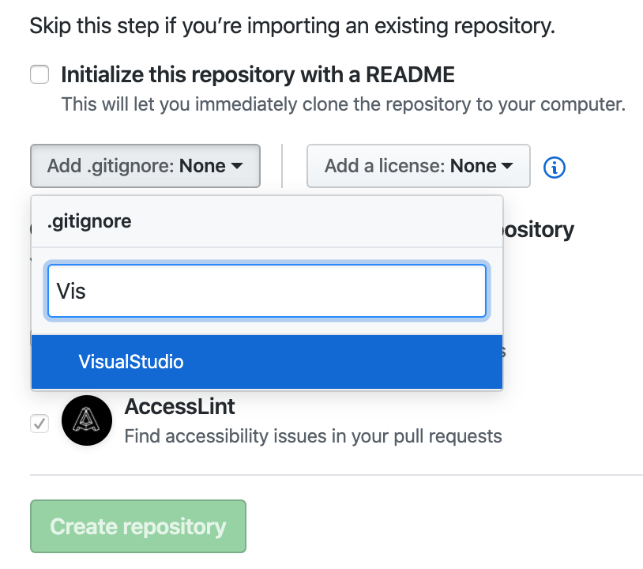

Sau đó clone về máy

### 2. Tạo project

Mở Visual Studio chọn New Project và chọn đúng project type là Class Library (Net Framework) và ngôn ngữ là C# như hình

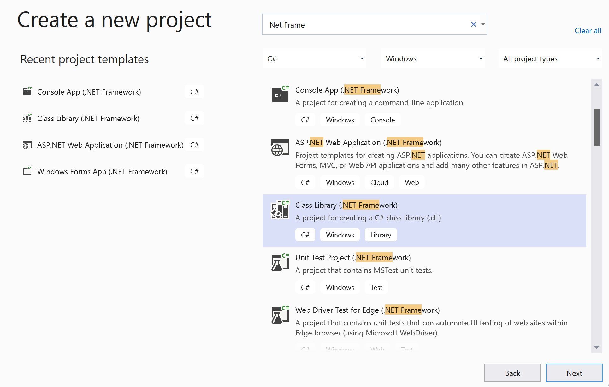

Nếu khó khăn trong việc tìm kiếm thì có thể có thể dùng filter. 

!Hint: Lần sau tạo project thì nó sẽ xuất hiện trong mục Recent Project Templates

Bấm Next, đặt tên cho Project (chẳng hạn ở đây là CSharpExercise) như hình (Nhớ chọn lại đường dẫn project đến thư mục git đã clone)

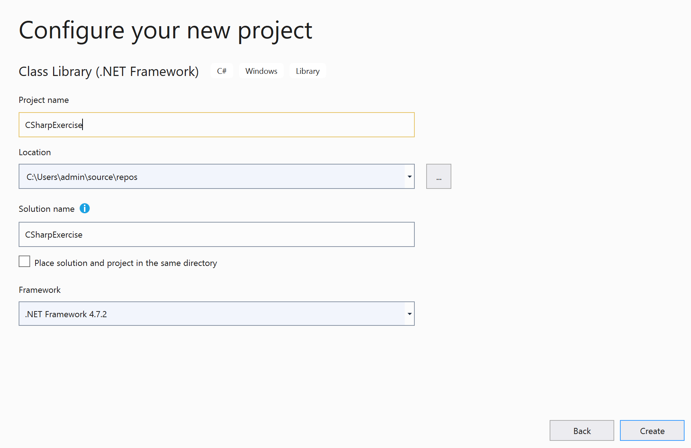

Sau đó bấm Create

### 3. Tạo Test Project

Right Click lên solution chọn New -> Project ->

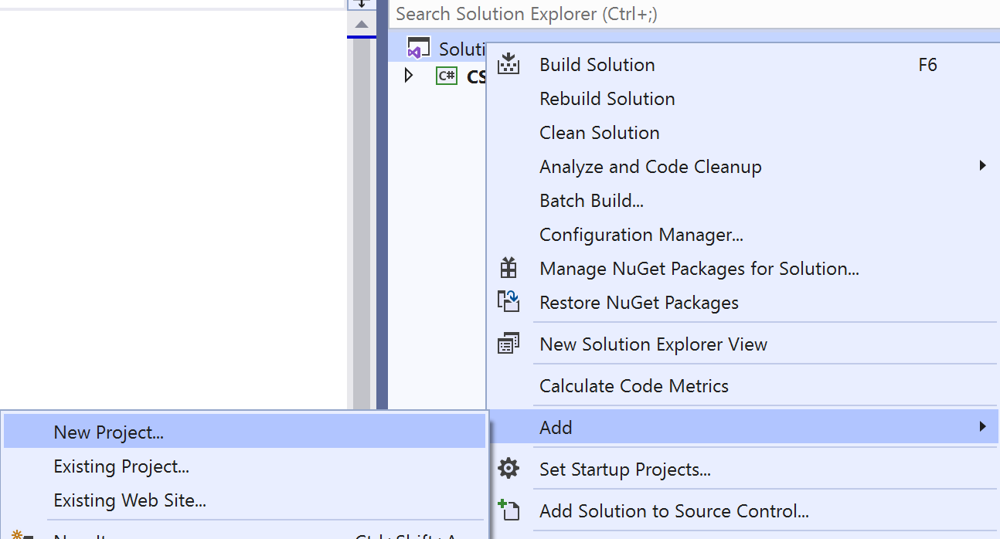

Lần này ở cửa sổ Project Templates, tìm và chọn Unit Test(Net Framework) và ngôn ngữ là C# như hình

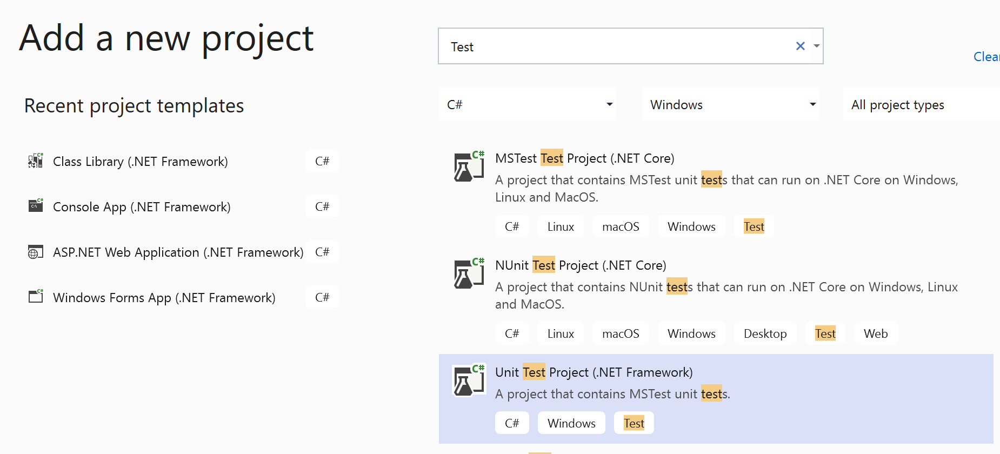

Bấm Next, ở màn hình tiếp theo, đặt tên Project là dùng tên Project ở trên và thêm chữ Test ở cuối. Chẳng hạn ở đây sẽ là CSharpExerciseTest

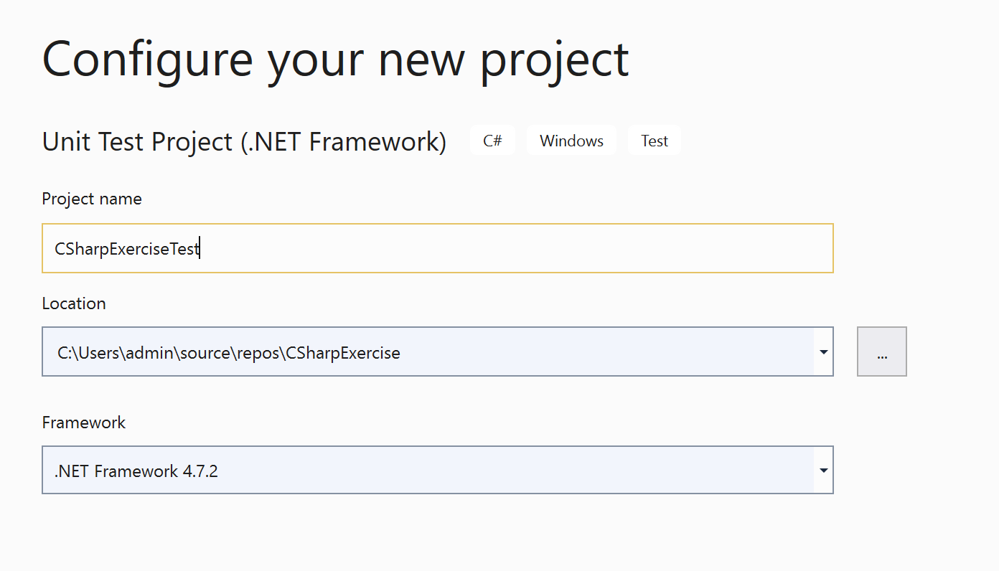

### 4. Liên kết Project vào Test Project

Đảm bảo sau các bước trên, ta thấy được 2 project như thế này

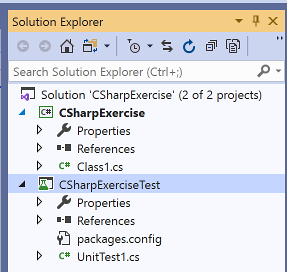

Right click lên mục References của Test project, chọn Add Reference

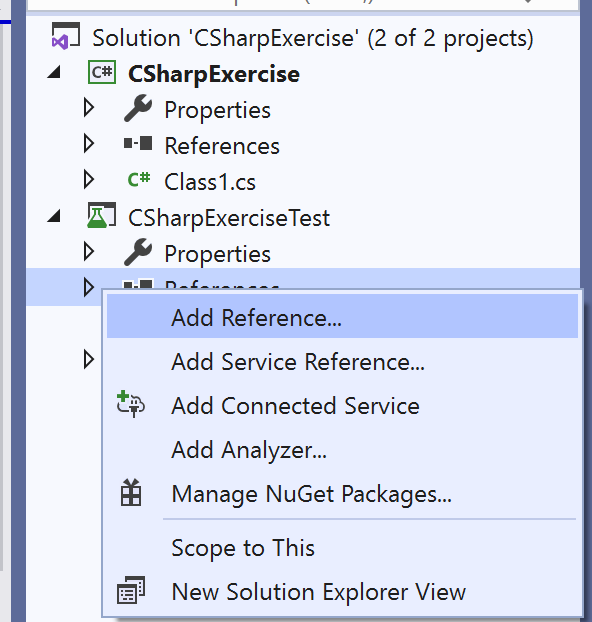

Trong màn hình Refrence Manager, check chọn vào Project 

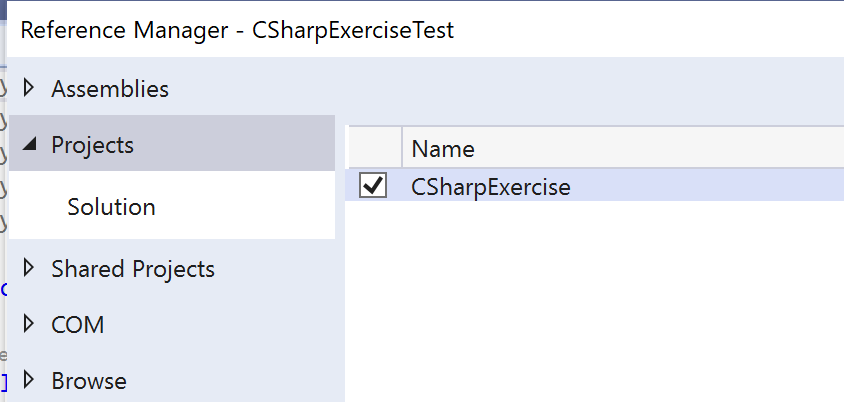

Xong rồi Done.

### 5. Implement code

Trong CSharpExercise right click chọn New Folder

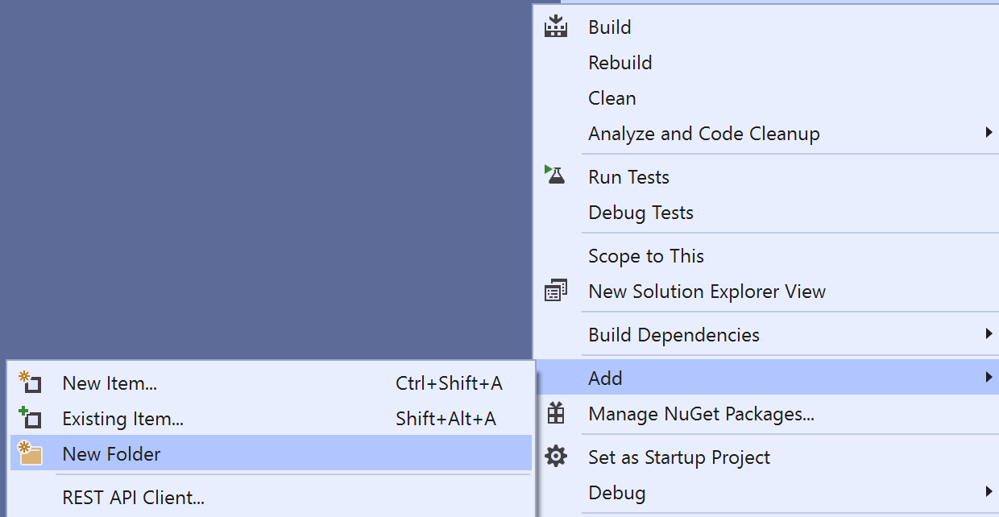

Đặt tên thư mục là BasicExercise

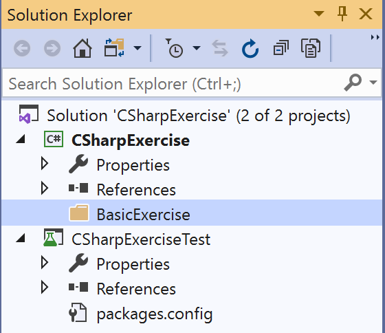

Tạo class trong thư mục BasicExercise bằng cách right click lên thư mục và chọn New Class

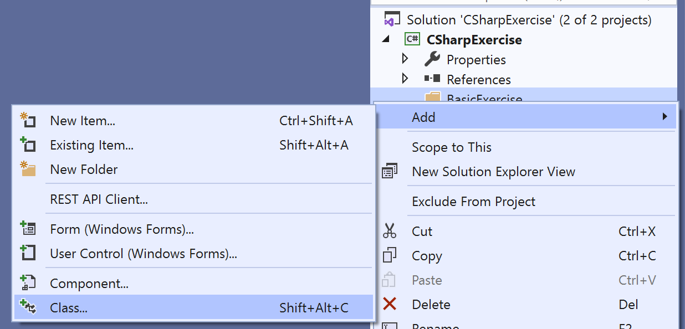

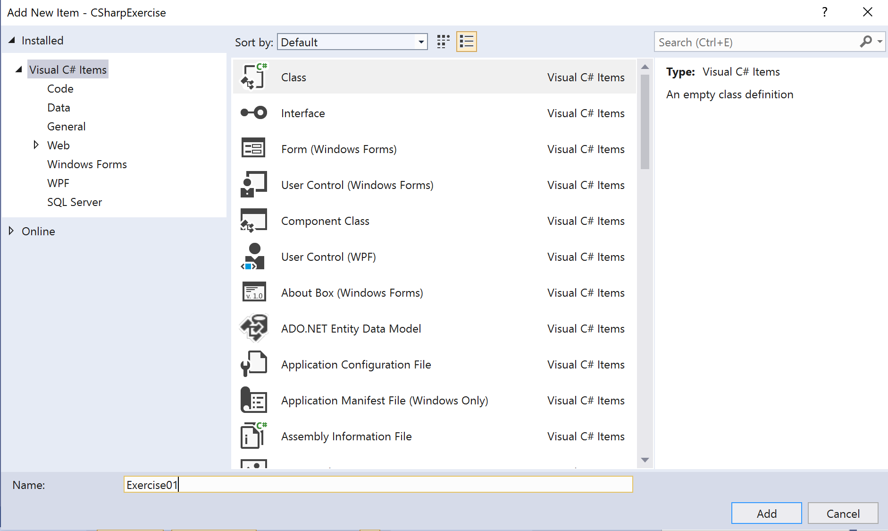

Sửa mã nguồn class thành thế này (bỏ qua phần using)

```csharp
namespace CSharpExercise.BasicExercise
{
    public class Exercise01
    {
        public int Sum(int a, int b)
        {
            return a + b;
        }
    }
}
```

Chú ý mặc định class được tạo ra lúc New Class không có từ khoá `public` nhưng ta cần refer nó từ tự án UnitTest nên phải thêm `public` vào

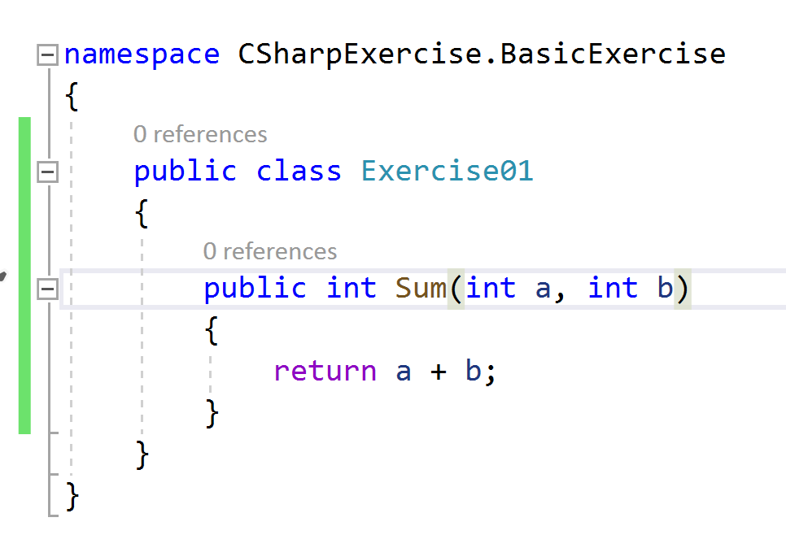

### 6. Implement Test code

Tương tự trên, tạo class tên là `Exercise01Test` trong thư mục `BasicExericseTest` trong tự án Test

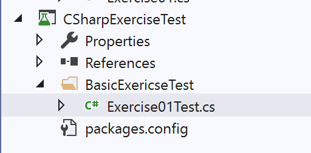

Viết mã nguồn là

```csharp
using CSharpExercise.BasicExercise;
using Microsoft.VisualStudio.TestTools.UnitTesting;

namespace CSharpExerciseTest.BasicExericseTest
{
    [TestClass]
    public class Exercise01Test
    {
        [TestMethod]
        public void TestSum()
        {
            var exercise01 = new Exercise01();

            Assert.AreEqual(exercise01.Sum(4, 5), 9);
            Assert.AreEqual(exercise01.Sum(4, 7), 11);
        }
    }
}
```

Chú ý ở đây đảm bảo:

- Đầy đủ các dòng using tới project code implement và thư viện Unit Test

- [TestClass] Attribute để cho biết class hiện tại là Test Class
- [TestMethod] Attribute cho biết Method là 1 test method


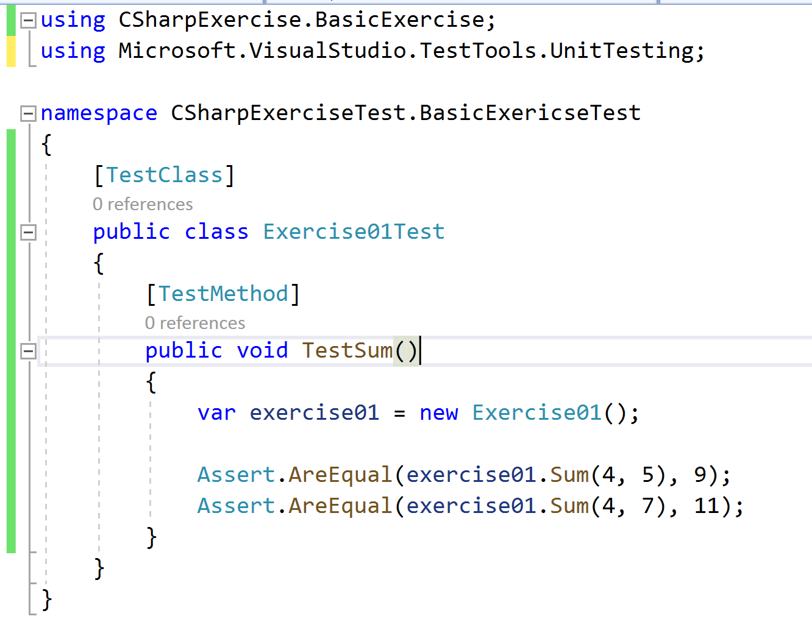

### 7. Chạy UnitTest

Right click lên Test class để chạy tất cả các unit test method

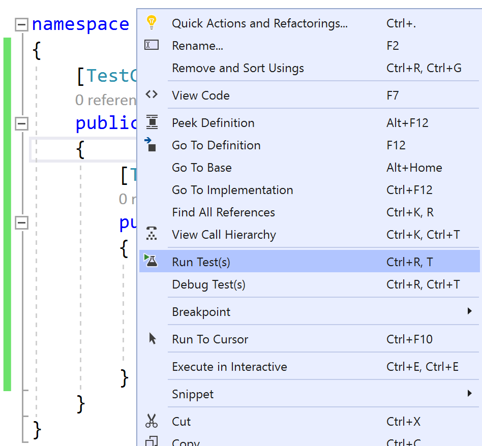

Đợi một chút trong khi Unittest được load và chạy sẽ thấy status như hình

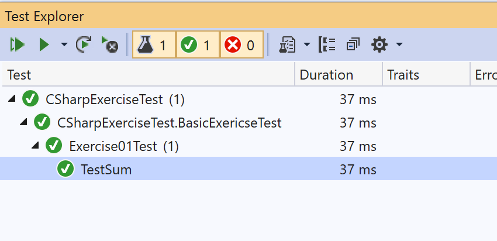

Dấu Tick như hình là Unit test đã pass


